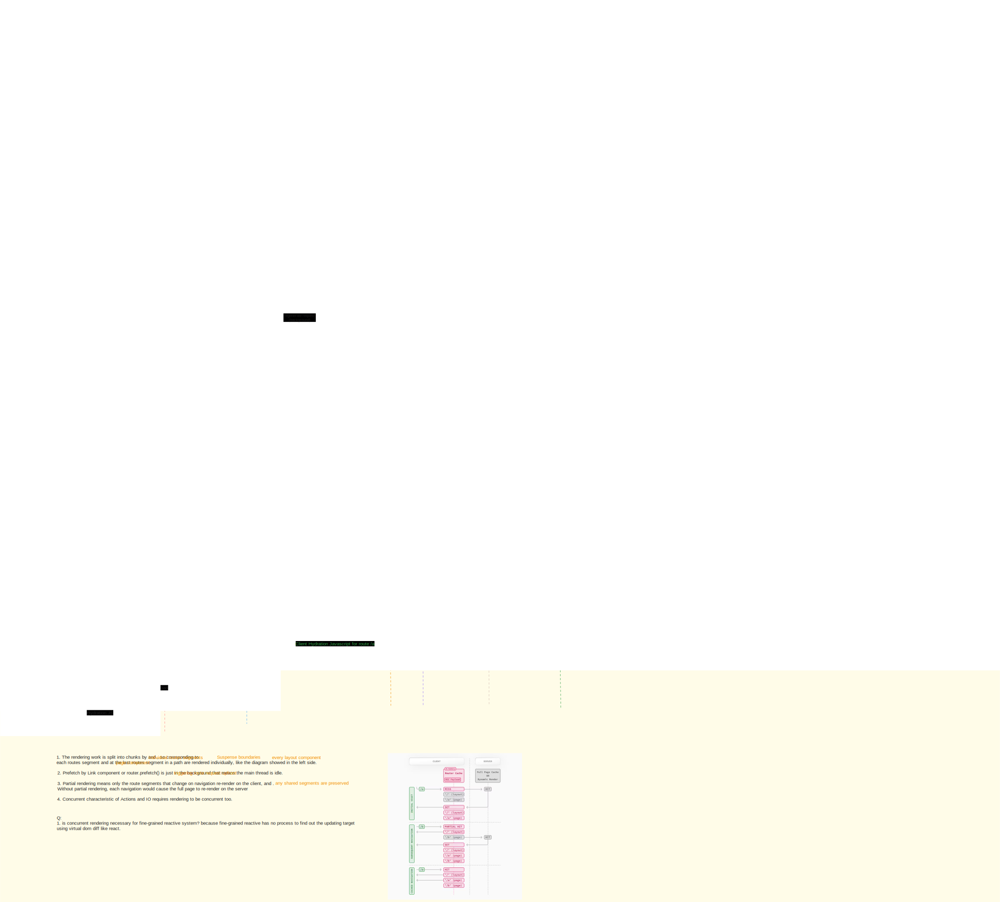

## Next.js App Router Course - Starter

This is the starter template for the Next.js App Router Course. It contains the starting code for the dashboard application.

For more information, see the [course curriculum](https://nextjs.org/learn) on the Next.js Website.

##To recap, you've done a few things to optimize data fetching in your application, you've:

- Created a database in the same region as your application code to reduce latency between your server and database.
- Fetched data on the server with React Server Components. This allows you to keep expensive data fetches and logic on the server, reduces the client-side JavaScript bundle, and prevents your database secrets from being exposed to the client.
- Used SQL to only fetch the data you needed, reducing the amount of data transferred for each request and the amount of JavaScript needed to transform the data in-memory.
- Parallelize data fetching with JavaScript - where it made sense to do so.
- Implemented Streaming to prevent slow data requests from blocking your whole page, and to allow the user to start interacting with the UI without waiting for everything to load.
- Move data fetching down to the components that need it, thus isolating which parts of your routes should be dynamic in preparation for Partial Prerendering.

## tech stack

- [Auth.js](https://authjs.dev/getting-started/introduction)
- tailwindcss
- bcrypt
- clsx
- zod

## references

- [Start building with Next.js](https://nextjs.org/learn?utm_source=next-site&utm_medium=homepage-cta&utm_campaign=home)

- [Docs](https://nextjs.org/docs)

#### key references

##### for framework

- [Routing](https://nextjs.org/docs/app/building-your-application/routing)
- [How Routing and Navigation Works](https://nextjs.org/docs/app/building-your-application/routing/linking-and-navigating#how-routing-and-navigation-works)
- [Streaming with Suspense](https://nextjs.org/docs/app/building-your-application/routing/loading-ui-and-streaming#streaming-with-suspense)
- [How are Server Components rendered?](https://nextjs.org/docs/app/building-your-application/rendering/server-components#how-are-server-components-rendered)
- [server rendering strategies](https://nextjs.org/docs/app/building-your-application/rendering/server-components#server-rendering-strategies)
- [How are Client Components Rendered?](https://nextjs.org/docs/app/building-your-application/rendering/client-components#how-are-client-components-rendered)
- [Caching in Next.js](https://nextjs.org/docs/app/building-your-application/caching)

##### for API feature

###### routing

- [Parallel Routes](https://nextjs.org/docs/app/building-your-application/routing/parallel-routes)

- [Intercepting Routes](https://nextjs.org/docs/app/building-your-application/routing/intercepting-routes)

- [Route Handlers](https://nextjs.org/docs/app/building-your-application/routing/route-handlers)

- [Middleware](https://nextjs.org/docs/app/building-your-application/routing/middleware)

###### Data fetching

- [Fetching Data on the Server with fetch](https://nextjs.org/docs/app/building-your-application/data-fetching/fetching-caching-and-revalidating#fetching-data-on-the-server-with-fetch)

- [Fetching Data on the Client with Route Handlers](https://nextjs.org/docs/app/building-your-application/data-fetching/fetching-caching-and-revalidating#fetching-data-on-the-client-with-route-handlers)

- [Forms and Mutations](https://nextjs.org/docs/app/building-your-application/data-fetching/forms-and-mutations)

###### Rendering

- [Route Segment Config](https://nextjs.org/docs/app/api-reference/file-conventions/route-segment-config)
- [Keeping Server-only Code out of the Client Environment](https://nextjs.org/docs/app/building-your-application/rendering/composition-patterns#keeping-server-only-code-out-of-the-client-environment)
- [Using Third-party Packages and Providers](https://nextjs.org/docs/app/building-your-application/rendering/composition-patterns#using-third-party-packages-and-providers)
- [Unsupported Pattern: Importing Server Components into Client Components](https://nextjs.org/docs/app/building-your-application/rendering/composition-patterns#unsupported-pattern-importing-server-components-into-client-components)
- [Supported Pattern: Passing Server Components to Client Components as Props](https://nextjs.org/docs/app/building-your-application/rendering/composition-patterns#supported-pattern-passing-server-components-to-client-components-as-props)

## next.js framework

## Q&A

- what is Route Handlers?

  Route Handlers allow you to create custom request handlers for a given route using the Web Request and Response APIs. This is actually the restful API. you can create a directory named with resource name in which putting the `route.js|ts` file that define handlers with Http methods like GET, POST, PUT, PATCH, DELETE, HEAD, and OPTIONS. All of them have the same route path, but different Http methods.

- what is the Middleware?

  it's same with the Middleware of koa. as if the interceptor of request which is kind of AOP.

- what templates is?

  Templates are similar to layouts in that they wrap each child layout or page. Unlike layouts that persist across routes and maintain state, templates create a new instance for each of their children on navigation. This means that when a user navigates between routes that share a template, a new instance of the component is mounted, DOM elements are recreated, state is not preserved, and effects are re-synchronized.
  [Templates](https://nextjs.org/docs/app/building-your-application/routing/pages-and-layouts#templates)

- what is `"use client"`?

  This directive refers to as this component is kind of client component.

- If there is multiple component like table in invoices which query data, how to send request?
  is there an API like fetch?

  No need to multiple fetches for multiple datas to the same one page. It seems like that all queries have been collected together on a page, a page is corresponding to a route, so on client, we just need to put parameters for all queries to the end of URL. On server, get all parameters and render the page with puting in them. So only one fetch is enough.

- what's the Next.js cache layer? (need to research further)

  The cache is to cache the result of API, it's capable to determine if static rendering or dynamic rendering. And also the cache has its original funcionality that's improving performance of quering data.

- what is the Client-side Router Cache?

  refer to [Router Cache](https://nextjs.org/docs/app/building-your-application/caching#router-cache)

- what is React cache function?

- what are Edge and Node.js Runtimes?
  [Edge and Node.js Runtimes](https://nextjs.org/docs/app/building-your-application/rendering/edge-and-nodejs-runtimes)

- whether static rendering after data revalidation is in the background or foreground？

- how is the font defined? what the format of font is?
